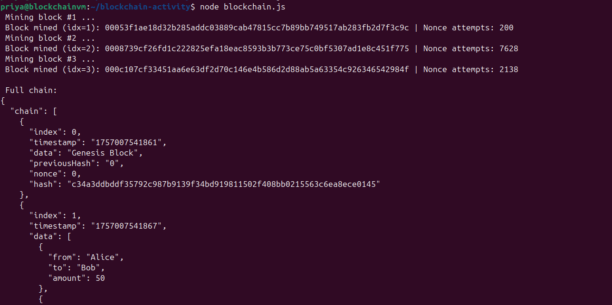
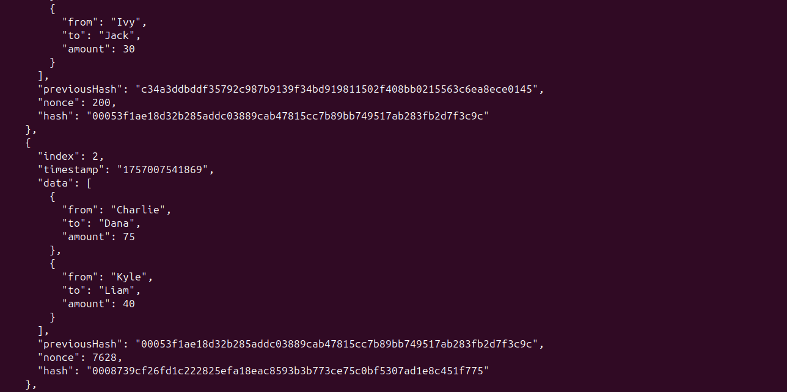
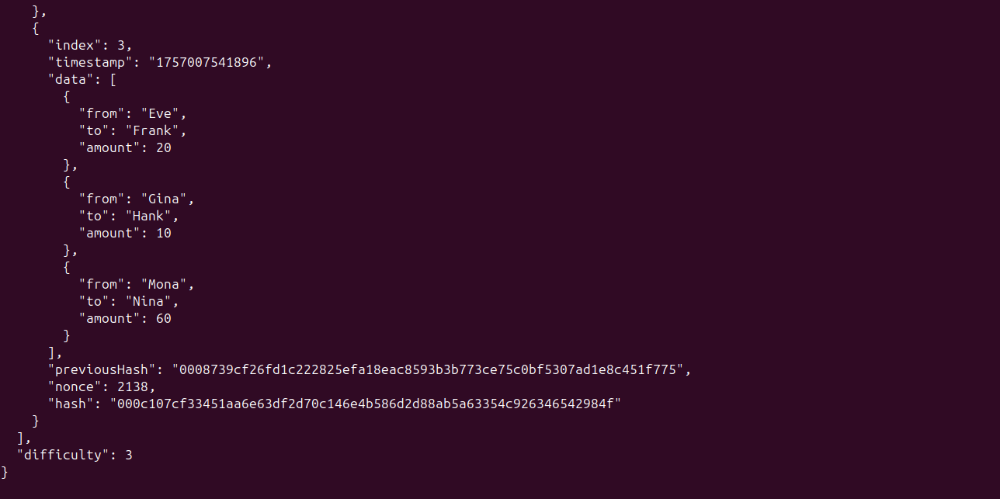
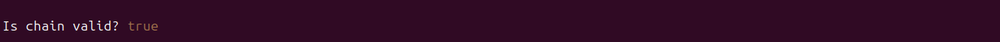
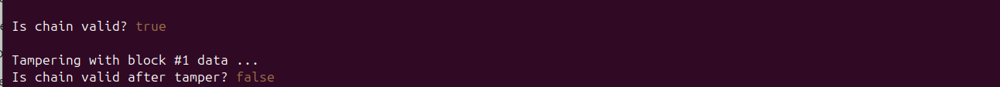

# Blockchain Assignment 1

## How to Run
Open your terminal in the project folder and run:
```bash
node blockchain.js

### Mining Output
Mining required finding hashes with `000` prefix and nonce attempts.

  
  
  

### Valid Chain
After mining, the blockchain validated correctly.  
  

### Tampered Chain
After manually editing Block #1, the blockchain detected the tampering.  


